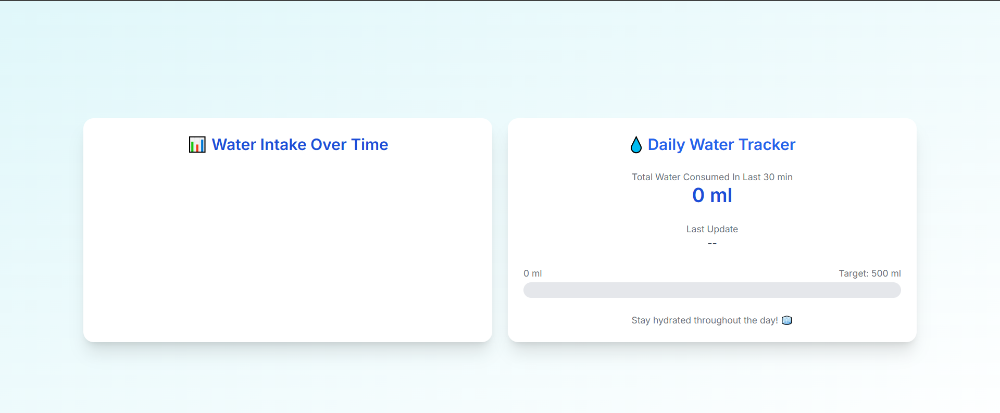

# Smart Water Bottle – Real-Time Hydration Monitoring System

An IoT-based smart water bottle that tracks water level in real-time using an ultrasonic sensor with Arduino. Sensor data is transmitted to a FastAPI backend, displayed via an HTML dashboard, and deployed on AWS EC2 using Docker.

---

## 🚀 Features

- Real-time hydration tracking using Arduino + Ultrasonic Sensor
- RESTful API built with FastAPI and Uvicorn
- Clean HTML dashboard for data visualization
- Simulated sensor (`faux_sensor.py`) for local testing
- Dockerized backend and frontend for easy deployment
- Hosted on AWS EC2 for remote access

---

## 🛠 Tech Stack

- **Hardware:** Arduino Uno, HC-SR04 Ultrasonic Sensor
- **Backend:** Python, FastAPI, Uvicorn
- **Frontend:** HTML/CSS
- **Deployment:** Docker, Docker Compose, AWS EC2

---



.png)

# Instructions to Run

- Install FastAPI locally

```
    pip install fastapi uvicorn
```

- For testing without Arduino.

```
    python external/faux_sensor.py
```

- While Arduino is connected.

```
    uvicorn external.sensor:app --host 0.0.0.0 --port 5000 --reload
```

- Run the Application.

```
    docker compose up --build -d
```

- Stopping the Application.

```
    docker compose down --remove-orphans
```
